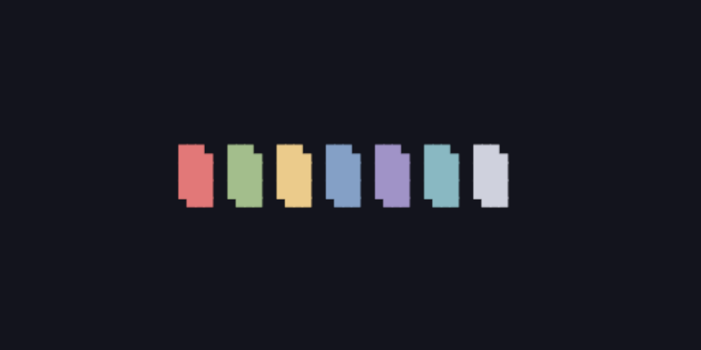

<h2 align="center"> ━━━━━━  ❖  ━━━━━━ </h2>

    <code>levamentum.vim</code> ~ A comfy colorscheme for Vim and other deriatives.

<h2 align="center"> ━━━━━━  ❖  ━━━━━━ </h2>

### ❖ Development

   * [Vim/Neovim](vim/levamentum.vim)

### ❖ Terminals

   * [Alacritty](terminal/alacritty/alacritty.yml)
   * [Termite](terminal/termite/config)

### ❖ Other

   * [Xresources](other/Xresources)

### ❖ Special Thanks

   * [Nord](https://www.nordtheme.com/) and [iceburg.vim](https://cocopon.github.io/iceberg.vim/) for the colors.
   * [Liz](https://github.com/LichKing112) for the name.
